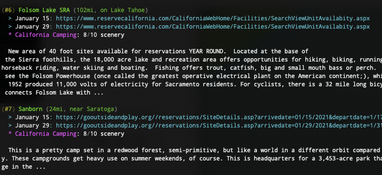

campwiz
==========
Command-line interface that lists Bay Area campsites that are available on a particular date, using:

* Santa Clara County Parks
* San Mateo County Parks
* Reserve America
* Reserve California



Requirements:
=============
* go v1.14+
* macOS, Windows, or any UNIX flavor

Usage:
======

To search campsites near San Francisco with a minimum rating for a particular set of dates:

```shell
 go run cmd/cw/cw.go --dates 2021-01-15,2021-01-29 --min_rating 7 \
   --nights 2 --max_distance 150
```

Roadmap:
========
- Improve Property vs Campground distinction (matching, display)
- Integrate additional metadata sources (Google Maps, Bing, Yelp)
- Provide a useful web frontend
